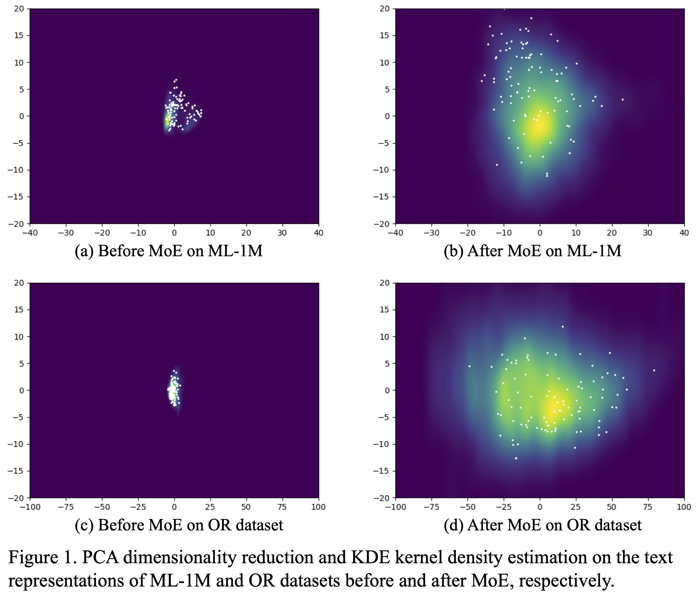

# Additional Experiments for TedRec

In this document, we have provided more experiments to comprehensively show the effectiveness of TedRec from the following 7 perspectives.

- [1. Generalization and scaling ability of TedRec: the relationship between data scale and the efficacy of the sequence-level representation fusion.](#1-generalization-and-scaling-ability-of-tedrec-the-relationship-between-data-scale-and-the-efficacy-of-the-sequence-level-representation-fusion)    
- [2. The impact of fusion methods on recommendation results.](#2-the-impact-of-fusion-methods-on-recommendation-results)    
- [3. The effectiveness of the mixture-of-experts (MoE) in improving the discriminability of textual representations.](#3-the-effectiveness-of-the-mixture-of-experts-moe-in-improving-the-discriminability-of-textual-representations)    
- [4. Introduction to text of our datasets and the impact of text on performance.](#4-introduction-to-text-of-our-datasets-and-the-impact-of-text-on-performance)    
- [5. The impact of text encoder and performance with other modalities.](#5-the-impact-of-text-encoder-and-performance-with-other-modalities)    
- [6. In-depth analysis on the impact of hyper-parameters on the performance of TedRec.](#6-in-depth-analysis-on-the-impact-of-hyper-parameters-on-the-performance-of-tedrec)    
- [7. The rationale of TedRec's performance improvement.](#7-the-rationale-of-tedrecs-performance-improvement)

## 1. Generalization and scaling ability of TedRec: the relationship between data scale and the efficacy of the sequence-level representation fusion.

We first explore the performance of TedRec and three baselines on three sizes of MovieLens datasets. As shown in Table 1, it can be seen that the performance improvement of TedRec compared to the runner-up model increases with the increase of interactions.

Table 1. Performance of TedRec with different ML datasets.

|  | ML-1M |  | ML-10M |  | ML-20M |  |
|:---:|:---:|:---:|:---:|:---:|:---:|:---:|
| Method | Recall@10 | NDCG@10 | Recall@10 | NDCG@10 | Recall@10 | NDCG@10 |
| SASRec | 0.2300 | 0.1146 | *0.1905* | *0.0954* | 0.1752 | 0.0876 |
| SASRecF | *0.2356* | *0.1249* | 0.1871 | 0.0950 | *0.1759* | *0.0883* |
| UniSRec | 0.2257 | 0.1140 | 0.1748 | 0.0853 | 0.1690 | 0.0830 |
| TedRec | **0.2623** | **0.1445** | **0.2157** | **0.1154** | **0.2048** | **0.1092** |
| Impr. | 11.33% | 15.69% | 13.23% | 20.96% | 16.43% | 23.67% |

We then explore the performance of TedRec with different scales of training data on the ML-1M dataset. We randomly select 20%, 40%, 60%, and 80% of the interaction data from the original dataset as new training data and report the model results. From Table 2, it can be seen that as the data scale of training data increases, the improvement of TedRec compared to the runner-up model also shows an upward trend.

Table 2. Performance of TedRec (Recall@10) with different scales of training data on the ML-1M dataset. 

| Scale | 20% | 40% | 60% | 80% | 100% |
|:---:|:---:|:---:|:---:|:---:|:---:|
| SASRec | 0.1955 | _0.2187_ | 0.2265 | 0.2227 | 0.2300 |
| SASRecF | 0.1987 | 0.2149 | _0.2295_ | _0.2306_ | _0.2356_ |
| UniSRec | _0.2055_ | 0.2147 | 0.2275 | 0.2242 | 0.2257 |
| TedRec | **0.2084** | **0.2328** | **0.2379** | **0.2546** | **0.2623** |
| Impr. | 1.41% | 6.45% | 3.66% | 10.41% | 11.33% |

## 2. The impact of fusion methods on recommendation results.

To further illustrate the impact of fusion methods on recommendation results, we compare five variants of TedRec with three kinds of backbones, with only fusion method changed (note that all variants in Table 3 are implemented with our proposed MoE adapter). As shown in Table 3, we can see that keeping all other components of TedRec unchanged and only varying the fusion method of text and ID to addition, concatenation and attention gating cannot match the effect of frequency-aware multiplication, demonstrating the effectiveness of our proposed fusion method. It is worth noting that the combination of attention mechanism and frequency-domain fusion can achieve optimal results.

Table 3. Performance of TedRec with different fusion methods on three backbones.

|  |  | ML-1M |  | OR |  |
|:---:|:---:|:---:|:---:|:---:|:---:|
| Backbone | Fusion Type | Recall@10 | NDCG@10 | Recall@10 | NDCG@10 |
| Transformer (SASRec) | None | 0.2273 | 0.1127 | 0.1526 | 0.0692 |
|  | MoE + Add | 0.2270 | 0.1171 | 0.1492 | 0.0728 |
|  | MoE + Concat + MLP | 0.2311 | 0.1168 | 0.1475 | 0.0715 |
|  | MoE + Attention Gate | 0.2257 | 0.1129 | 0.1505 | 0.0681 |
|  | MoE + Frequency | **0.2623** | **0.1445** | **0.2234** | **0.1316** |
| GNN (GCSAN) | None | 0.2358 | 0.1285 | 0.1410 | 0.0667 |
|  | MoE + Add | 0.2295 | 0.1205 | 0.1390 | 0.0644 |
|  | MoE + Concat + MLP | 0.2278 | 0.1222 | 0.1327 | 0.0641 |
|  | MoE + Attention Gate | 0.2326 | 0.1254 | 0.1433 | 0.0682 |
|  | MoE + Frequency | **0.2404** | **0.1310** | **0.1576** | **0.0828** |
| Frequency (FMLPRec) | None | 0.2363 | 0.1234 | 0.1492 | 0.0690 |
|  | MoE + Add | 0.2354 | 0.1218 | 0.1489 | 0.0668 |
|  | MoE + Concat + MLP | 0.2333 | 0.1245 | 0.1528 | 0.0750 |
|  | MoE + Attention Gate | 0.2354 | 0.1213 | 0.1508 | 0.0672 |
|  | MoE + Frequency | **0.2543** | **0.1418** | **0.1863** | **0.0984** |

## 3. The effectiveness of the mixture-of-experts (MoE) in improving the discriminability of textual representations.

To validate the effectiveness our proposed MoE-enhanced text adapter for discriminable textual representations, we perform PCA dimensionality reduction and KDE kernel density estimation on the textual representations of ML-1M and OR datasets before and after MoE, respectively. As illustrated in [Figure 1](https://anonymous.4open.science/r/TedRec/asset/text_dis.png), we can see that our MoE-enhanced text adapter increases the distinguishability of text embedding and provides **smooth anisotropic semantic space** for general texts since representations after MoE are more uniformly distributed within the same coordinate system. 

## 4. Introduction to text of our datasets and the impact of text on performance.

Regarding the text in our datasets, we follow the setting in UniSRec and obtain the text by concatenating the item attributes (we **do not** use informative text descriptions). We provide the average length, selected features and example case of the text used in five datasets, and datasets can be downloaded in [anonymous link](https://anonymous.4open.science/r/TedRec/dataset). As shown in Table 4, on average, each text in the ML-1M and OR datasets only has four or five words, and only title, brand, and category features were used in the Amazon dataset.

Table 4. Text Introduction of Our Datasets.

| Datasets | Avg. text length | Selected features | Text example |
|:---:|:---:|:---:|:---:|
| ML-1M | 5.73  | title + year + genre | Max Dugan Returns 1983 Comedy |
| OR | 4.41  | keyword | doctor's bag soft toy. |
| Office | 28.47  | title + brand + category | Butterfly Notebook. Office Products Office & School   Supplies Paper. Sovak.  |
| Food | 24.58  | title + brand + category | Wilton Halloween 2 Color Kit. Grocery & Gourmet Food   Cooking & Baking. Wilton.  |
| Movies | 15.77  | title + brand + category | The God Question. Movies & TV Movies. |

In order to further analyze the impact of text abundance on TedRec, we trim the text data of ML-1M and OR to varying degrees, and report the results of different proportions of text length to the original text in Table 5. We can see that even if the text is only one-fifth of its original length, the result of TedRec shows only a slight change, proving that our method **does not** rely on the amount of information in the text.

Table 5. Impact of Text Length on TedRec.

|  | ML-1M |  | OR |  |
|:---:|:---:|:---:|:---:|:---:|
| Text Length | Recall@10 | NDCG@10 | Recall@10 | NDCG@10 |
| 20% | 0.2603 | 0.1439 | 0.2232 | 0.1294 |
| 40% | 0.2578 | 0.1421 | 0.2231 | 0.1308 |
| 60% | 0.2616 | 0.1442 | 0.2219 | 0.1308 |
| 80% | 0.2558 | 0.1396 | 0.2200 | 0.1304 |
| 100% | **0.2623** | **0.1445** | **0.2234** | **0.1316** |

We also consider the effects of selecting different item features as text for the ML-1M dataset, and reports results of TedRec in Table 6. We can see that using movie descriptions with a large amount of text data does not bring performance gains to TedRec on the ML-1M dataset. Proper feature selection is the key to TedRec's use of text.

Table 6. Impact of Selected Features on ML-1M.

| Feature | Avg. length | Recall@10 | NDCG@10 |
|:---:|:---:|:---:|:---:|
| genre | 1.71 | 0.2586 | **0.1445** |
| title | 3.02 | 0.2589 | 0.1430 |
| genre + title + year | 5.73 | **0.2623** | **0.1445** |
| description | **97.29** | 0.2530 | 0.1400 |

## 5. The impact of text encoder and performance with other modalities.

In terms of the language models as text encoder, we can see that TedRec is **robust enough to adapt to various sizes of BERT and RoBERTa**, with the 768-dimensional BERT-base still achieving optimal results. Table 7 shows that our method does not significantly rely on the richness of text representation, and our fused framework plays a core role.

Table 7. Impact of language models with different sizes.

|  |  | ML-1M |  | OR |  |
|:---:|:---:|:---:|:---:|:---:|:---:|
| LM | Dim. size | Recall@10 | NDCG@10 | Recall@10 | NDCG@10 |
| Random | 768 | 0.2315 | 0.1238 | 0.1676 | 0.0865 |
| BERT tiny | 128 | 0.2550 | 0.1399 | 0.2183 | 0.1283 |
| BERT mini | 256 | 0.2545 | 0.1403 | 0.2203 | 0.1291 |
| BERT small | 512 | 0.2584 | 0.1414 | 0.2206 | 0.1296 |
| BERT medium | 512 | 0.2526 | 0.1385 | 0.2187 | 0.1276 |
| BERT base | **768** | **0.2623** | **0.1445** | **0.2234** | **0.1316** |
| BERT large | 1024 | 0.2583 | 0.1419 | 0.2222 | 0.1303 |
| RoBERTa base | 768 | 0.2591 | 0.1438 | 0.2182 | 0.1276 |
| RoBERTa large | 1024 | 0.2561 | 0.1411 | 0.2198 | 0.1287 |

We also conduct experiments to verify the effectiveness of TedRec in modalities like images. For convenience, we use the multi-modal dataset "Electronics" released in [BM3](https://dl.acm.org/doi/10.1145/3543507.3583251), and process it into chronological sequences for sequential recommendation. Electronics dataset has 192403 users, 63001 items and 1496785 interactions, and already contains text and image features extracted from Sentence-Transformers and CNN, with dimension sizes of 384 and 4096, respectively. As shown in Table 8, we can see that on the sparse Electronics dataset, SASRec, which relies solely on ID, achieves poor results, and both text and image modalities can improve the recommendation performance. Furthermore, **the fusion strategy of TedRec can work in both image modality and multimodal scenarios**, indicating the application scenario and research potential of our proposed method.

Table 8. Performance of models with different modalities on the Electronics dataset.

| Modality | Model | NDCG@1 | NDCG@5 | NDCG@10 |
|:---:|:---:|:---:|:---:|:---:|
| ID | SASRec | 0.0007 | 0.0149 | 0.0201 |
| ID + text | UniSRec | 0.0069 | 0.0181 | 0.0237 |
| ID + text | TedRec | 0.0099 | 0.0211 | 0.0265 |
| ID + image | UniSRec | 0.0069 | 0.0182 | 0.0235 |
| ID + image | TedRec | 0.0103 | 0.0209 | 0.0261 |
| ID + text + image | UniSRec | 0.0069 | 0.0183 | 0.0239 |
| ID + text + image | TedRec | **0.0108** | **0.0215** | **0.0267** |

## 6. In-depth analysis on the impact of hyper-parameters on the performance of TedRec.

Hyper-parameter analysis is an important aspect of effectiveness. In the following tables, we analyze the impact of hyper-parameters on TedRec from four perspectives: number of experts, dimension size, language model scale and learning rate.

|  | ML-1M |  | OR |  |
|:---:|:---:|:---:|:---:|:---:|
| Expert num | Recall@10 | NDCG@10 | Recall@10 | NDCG@10 |
| 1 | 0.2523 | 0.1370 | 0.2172 | 0.1298 |
| 2 | 0.2533 | 0.1394 | 0.2211 | 0.1295 |
| 3 | 0.2601 | 0.1409 | 0.2219 | 0.1284 |
| 4 | 0.2560 | 0.1422 | 0.2215 | 0.1301 |
| 5 | 0.2586 | 0.1435 | 0.2196 | 0.1276 |
| 6 | 0.2540 | 0.1398 | 0.2193 | 0.1301 |
| 7 | 0.2528 | 0.1415 | 0.2222 | 0.1305 |
| 8 | **0.2623** | **0.1445** | **0.2234** | **0.1316** |
| 9 | 0.2543 | 0.1404 | 0.2180 | 0.1285 |
| 10 | 0.2548 | 0.1386 | 0.2189 | 0.1296 |

|  | ML-1M |  | OR |  |
|:---:|:---:|:---:|:---:|:---:|
| Dim size | Recall@10 | NDCG@10 | Recall@10 | NDCG@10 |
| 64 | 0.2159 | 0.1071 | 0.1849 | 0.1016 |
| 128 | 0.2368 | 0.1300 | 0.2067 | 0.1191 |
| 256 | 0.2533 | 0.1411 | 0.2197 | 0.1293 |
| 300 | **0.2623** | **0.1445** | **0.2234** | **0.1316** |
| 512 | 0.2522 | 0.1396 | 0.2132 | 0.1225 |

|  | ML-1M |  | OR |  |
|:---:|:---:|:---:|:---:|:---:|
| PLM size | Recall@10 | NDCG@10 | Recall@10 | NDCG@10 |
| BERT tiny | 0.2550 | 0.1399 | 0.2183 | 0.1283 |
| BERT mini | 0.2545 | 0.1403 | 0.2203 | 0.1291 |
| BERT small | 0.2584 | 0.1414 | 0.2206 | 0.1296 |
| BERT medium | 0.2526 | 0.1385 | 0.2187 | 0.1276 |
| BERT base | **0.2623** | **0.1445** | **0.2234** | **0.1316** |
| BERT large | 0.2583 | 0.1419 | 0.2222 | 0.1303 |

|  | ML-1M |  | OR |  |
|:---:|:---:|:---:|:---:|:---:|
| lr | Recall@10 | NDCG@10 | Recall@10 | NDCG@10 |
| 0.0003 | 0.2609 | 0.1442 | **0.2277** | **0.1355** |
| 0.0005 | 0.2584 | 0.1434 | 0.2230 | 0.1326 |
| 0.001 | **0.2623** | **0.1445** | 0.2234 | 0.1316 |
| 0.003 | 0.2260 | 0.1160 | 0.2179 | 0.1266 |
| 0.005 | 0.1727 | 0.0872 | 0.0455 | 0.0227 |

## 7. The rationale of TedRec's performance improvement.

The core component of TedRec is the Text-ID Mutual Filtering.
Unlike prior work (e.g., FMLPRec), we are the **first** to conduct the fusion of *text and IDs* in the frequency domain, which could also provide new insights and performance enhancements for integrating other modalities such as image data. **Our fusion method is model-agnostic and can adapt to various model architectures such as GNNs**. In this paper, we utilize attention-based backbone, i.e., SASRec as the backbone for sequential recommendation. As shown in our main table, we can see that both SASRecF and UniSRec use the attention mechanism for sequence representation learning with side information, but their results are significantly worse than ours. It is precisely because the direct addition of UniSRec and the concatenation of SASRecF combined with MLP cannot effectively solve the problem of modality fusion that our proposed TedRec becomes particularly important.

Specifically, TedRec has two key properties: 1. Disentangled contextual integration. 2. Contextual invariance.
With these superior properties, TedRec could significantly enhance the **generalization** and **scaling** ability of backbone models, which largely improves the sequential modeling performance in modality fusion and large-scale scenarios (See experiments in Table 1 and 2).

For better understanding, we elaborate on the theoretical properties of TedRec as follows:

**(1) Disentangled contextual integration.**

As proved in our paper (LEMMA 3.2), the text-ID fused sequence representation at the $j$ -th position $v_j$ can be modeled by combining both the past and future information of the sequence, i.e., $v_j = S(0, j) + S(j+1, n-1)$, where $S(m, n)$ is the text-ID sequential convolution between the $m$ -th and $n$ -th position. This property can improve the **generalization capabilities of the sequence-level fusion by reusing learned patterns**.
For example, we consider the following samples:

Table 9. Example of TedRec's disentangled contextual integration.

| Position | 1 | 2 | 3 | ... | 60|61 | 62 | 63 |
|-----|-----|:-----:|:-----:|-----|:-----:|-----|:-----:|-----|
| Seq 1 | $a$ | $b$ | $c$ |... | k| d | e | f |
| Fused Rep | - | - | $S_1(1,3) + S_1(4,63)$ |-| - | - | - | - |
| Seq 2 | $m$ | $n$ | $p$ | ... | $t$|$a$ | $b$ | $c$ |
| Fused Rep |-|-| -| - | $S_2(1, 60) + S_2(61, 63)$ | -|-|- |

Here $S_1(1,3) = S_2(61, 63) = at_c + bt_b+ct_a$, which means that we can reuse the learned partial representations of Seq 1 for Seq 2.
This property is extremely useful, especially when scaling with larger datasets where many users have overlapping sub-sequences (Experiments in Appendix).
Note that although architectures such as Transformer can capture sequence-level interactions globally ( $v_j = \text{softmax}(Q^\top K_j)V_j$ ), the attention mechanism within a sequence cannot be disentangled ( $v_j \neq S(0, j) + S(j+1, n-1)$ ) due to the nonlinear nature of attention calculation, thus lacking the generalization for sharing semantic similarities of sub-sequences.

**(2) Contextual invariance.**

Previous frequency-based methods such as FMLPRec mainly perform convolution through IDs and filter weights. They fail to capture contextual information of sub-sequences, since the same sub-sequence can have rather different representations at different positions. 
In contrast, the binding effect of IDs and text in TedRec can effectively overcome this issue, enabling it to more efficiently learn user behavior at the sequence level.

For example, in FMLPRec and TedRec, the convolution results of sequence $[a,b,c]$ at different positions are shown as:

Table 10. Example of FMLPRec's contextual variance.

| Position | 1 | 2 | 3 | ... | 61 | 62 | 63 |
|-----|-----|:-----:|-----|-----|-----|:-----:|-----|
| ID | $a$ | $b$ | $c$ |... |a | b | c |
| Conv | ↘ | ↓ | ↙ | - |↘ | ↓ | ↙|
| Weight | $w_1$ | $w_2$ | $w_3$ | ... | $w_{61}$ | $w_{62}$ | $w_{63}$ |
| Fused in FMLPRec | |$aw_3 + bw_2+cw_1$|  | $\neq$ |  | $aw_{63} + bw_{62}+cw_{61}$ |

Table 11. Example of TedRec's contextual invariance.

| Position | 1 | 2 | 3 | ... | 61 | 62 | 63 |
|-----|-----|:-----:|-----|-----|-----|:-----:|-----|
| ID | $a$ | $b$ | $c$ |... |a | b | c |
| Conv | ↘ | ↓ | ↙ | - |↘ | ↓ | ↙|
| Text | $t_a$ | $t_b$ | $t_c$ | ... | $t_a$ | $t_b$ | $t_c$ |
| Fused in TedRec | |$at_c + bt_b+ct_a$|  | $=$ |  | $at_c + bt_b+ct_a$ |

We can see that in FMLPRec, the representation of the sequence [a, b, c] at different positions is significantly different.
Whereas in text-ID fusion of TedRec, the sequential representations are solely based on contextual information and are independent of positions.
This provides a new way to improve the model's generalization ability by **reusing the same context/sub-sequence from different users' sequences**.